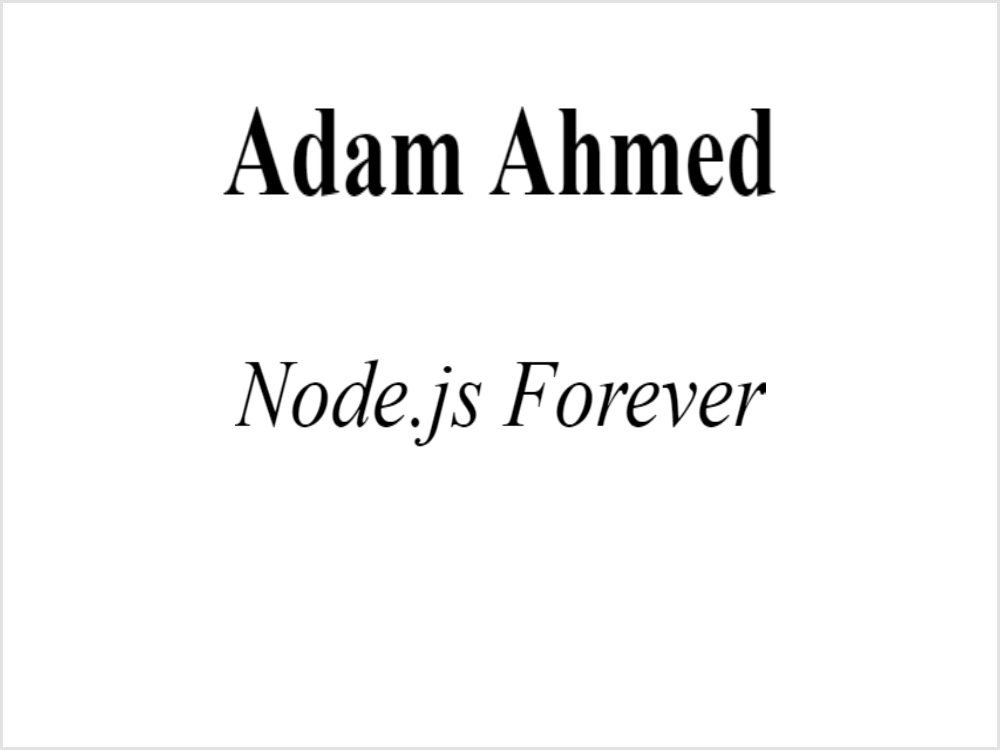

### Hi there 👋!
## I am Adam Ahmed. Front-end and Node.js developer. 

[]

- 🔭 I’m currently working with Hack Club!
- 💬 Ask me anything
- 📫 How to reach me: [Click Me!](mailto:adam@readisten.com)
- ⚡ Fun fact: I am starting high school soon!

[]

### Skills
  
  
  
  
  
  
  
  

  []

 THANKS FOR READING MY README. I hope you learned more about me!

